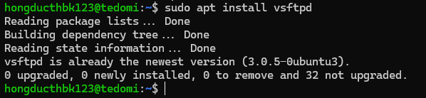
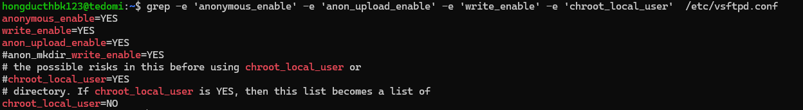
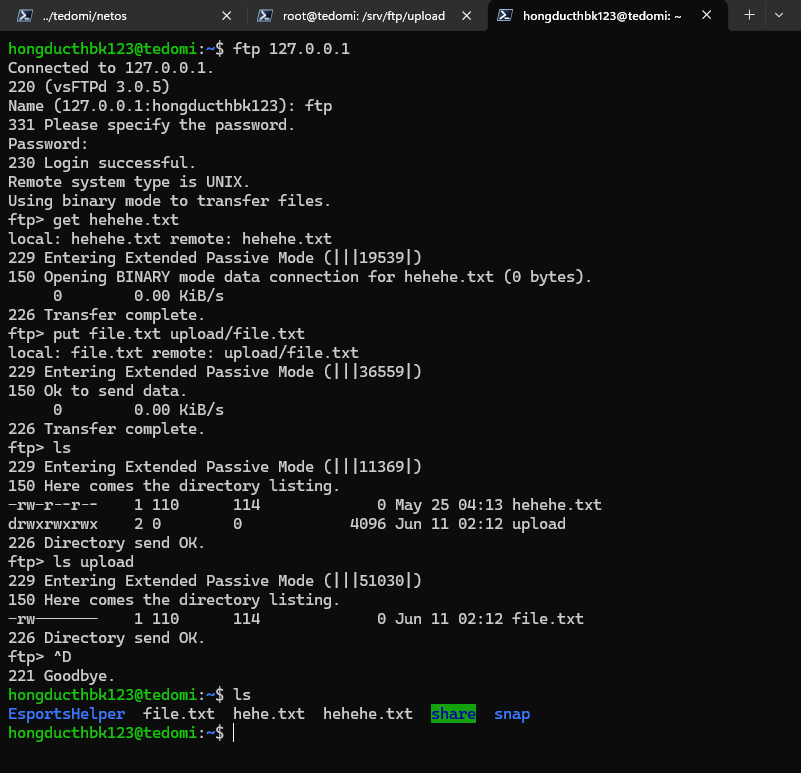
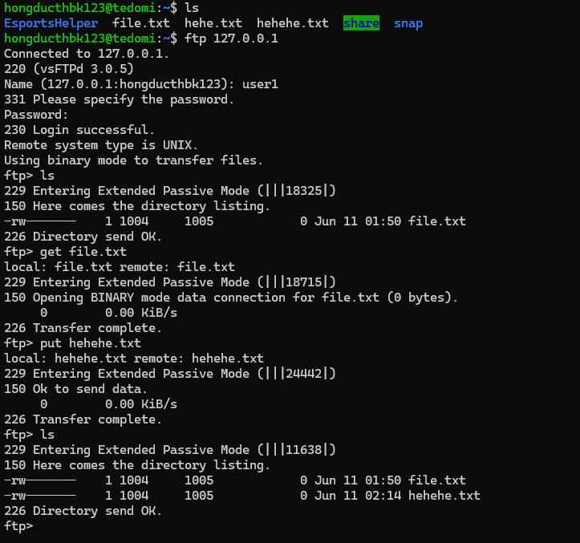
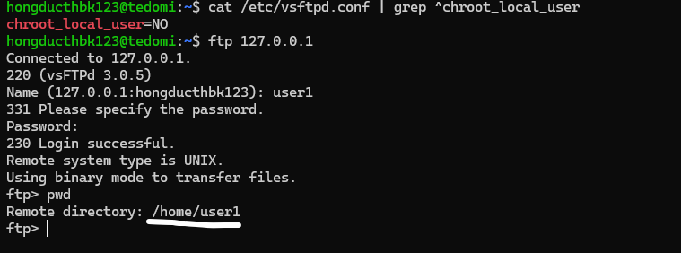
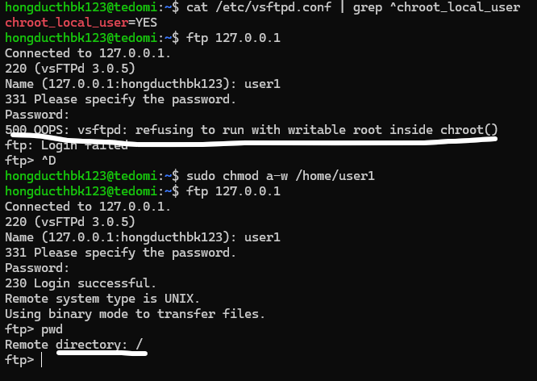

# Requirements

Cài đặt ftp server nếu chưa có. Thực hiện các thao tác: 
- Log in vào với người dùng anonymous (hoặc ftp), thực hiện thao tác upload và download 
với người dùng này 
- Log in vào với người dùng user1 (nếu chưa có tạo người dùng user1), thực hiện tao tác 
upload và download với người dùng này 

- Minh hoạ tuỳ chọn YES và NO với chroot_local_user với người dùng user1

# Solutions 


## Commands


### Prerequisites

Install vsftpd

```sh
sudo apt install vsftpd
```

### Command 1


Configure ftp daemon

```sh
sudo nano /etc/vsftpd.conf
```

File content:
```
anonymous_enable=YES
anon_upload_enable=YES
write_enable=YES
chroot_local_user=YES
```

Restart service after configuration

```sh
sudo systemctl restart vsftpd.service
```

### Command 2

Login to ftp server

```sh
ftp 127.0.0.1
```
Note: User `ftp` doesn't have password
### Command 3
To upload file:

```sh
put file.txt
```

To download file:
```sh
get file.txt
```


## Results

### Configuration





### Result 1
Upload/download using `ftp` user



### Result 2
Upload/download using `user1` user




### Result 3
`chroot_local_user` demonstration:



