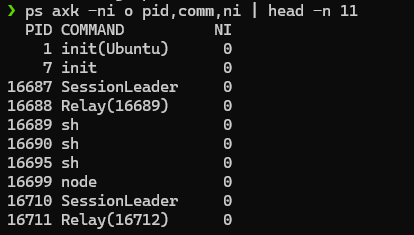

# Requirements

- Dùng lệnh `ps` xem giá trị `NICE` của các tiến trình.
- Sau đó dùng lệnh `top` hoặc `renice` để thay đổi giá trị `NICE` của các tiến trình trong hệ thống

# Solutions 


## Commands

### Command 1 

Show top 10 process and their **NICE** value

```sh
ps axk -ni o pid,comm,ni | head -n 11
```


### Command 2 

Check process **node**'s **PID** and current **NICE** value

```sh
ps -C node o pid,comm,ni
```

Change process **node**'s **NICE** value

```sh
renice +1 [PID]
```

Or use **top** command

```sh
top
```

Then press <kbd>r</kbd> to type **PID** and new **NICE** value

Check process **node**'s new **NICE** value

```sh
ps -C node o pid,comm,ni
```


## Results


### Result of Command 




### Result of Command 2


