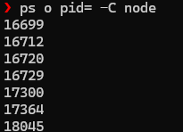
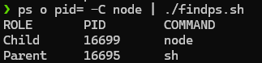
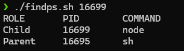

# Requirements

- Viết script `findps.sh` với đầu vào là 1 số. Script sẽ tìm trong hệ thống tiến trình có `PID` là tham số đã nhập, đồng thời in ra `PID` và Tên của tiến trình cha của nó


# Solutions 


## Commands


### Command 1 

Create file **findps.sh**

```sh
nano findps.sh
```

File content

```sh
if [ -z "$1" ]
then
  read PID
else
  PID=$1
fi

PID_NAME=$(ps o comm= -p $PID)
P_PID=$(ps o ppid= -p $PID)
PPID_NAME=$(ps o comm= -p $P_PID)

printf "%-10s %-10s %-10s\n" "ROLE" "PID" "COMMAND"
printf "%-10s %-10s %-10s\n" "Child" "$PID" "$PID_NAME"
printf "%-10s %-10s %-10s\n" "Parent" "$(echo $P_PID | tr -s ' ')" "$PPID_NAME"
```

Make file executable

```sh
chmod a+x findps.sh
```


### Command 2 

Find process **node**'s **PID**

```sh
ps o pid= -C node
```

Run script with found **PID**

```sh
ps o pid= -C node | sh findps.sh 
```


## Results


### Result of Command 1


### Result of Command 2 

First way



Second way

