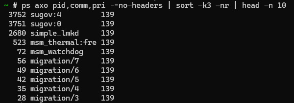

# Requirements

- In ra 10 tiến trình có độ ưu tiên cao nhất (sắp xếp theo thứ tự từ cao
đến thấp)


# Solutions 


## Commands


### Command 1
```sh
ps axo pid,comm,pri --no-headers | sort -k3 -nr | head -n 10
```

## Results


### Result of Command 1 
