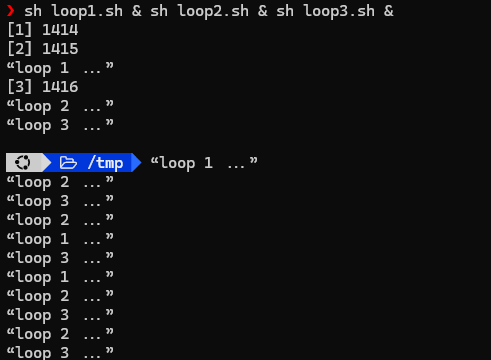
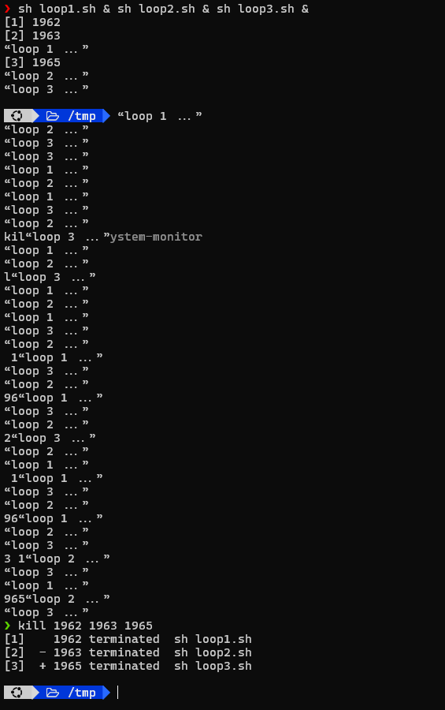

# Requirements

- Viết `loop{1,2,3}.sh` với nội dung tương ứng như sau:

```sh
while true; do
	echo “loop {1,2,3} ...”
	sleep 1
done
```

- Chạy 3 file này sao cho các tiến trình tương ứng hoạt động ở trạng
thái nền. Tắt từng tiến trình này


# Solutions 


## Commands


### Command 1 
Create 3 scripts and make them executable
```sh
touch loop1.sh loop2.sh loop3.sh && chmod a+x loop*.sh
```

Write content for 3 scripts

```sh
nano loop1.sh
```

```sh
nano loop2.sh
```

```sh
nano loop3.sh
```

Running 3 scripts in the background

```sh
sh loop1.sh & sh loop2.sh & sh loop3.sh &
```


### Command 2

Kill 3 scripts's background processes 

```sh
kill pid_1 pid_2 pid_3
```

or
```sh
fg
```

then <kbd>Ctrl</kbd>+<kbd>C</kbd>


## Results


### Result of Command 1 




### Result of Command 2 

