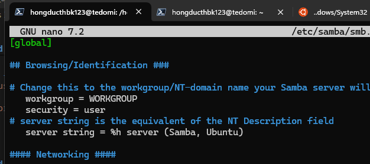
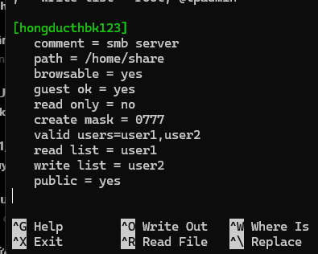
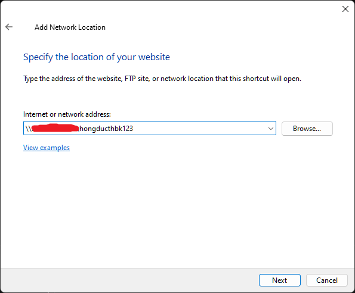
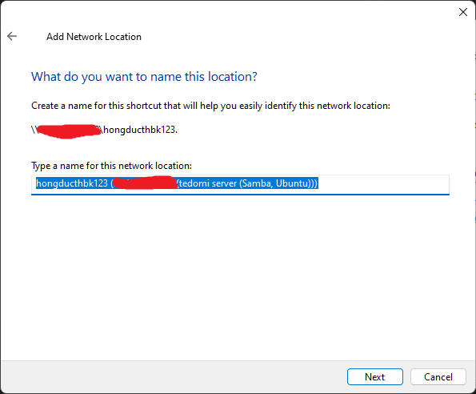
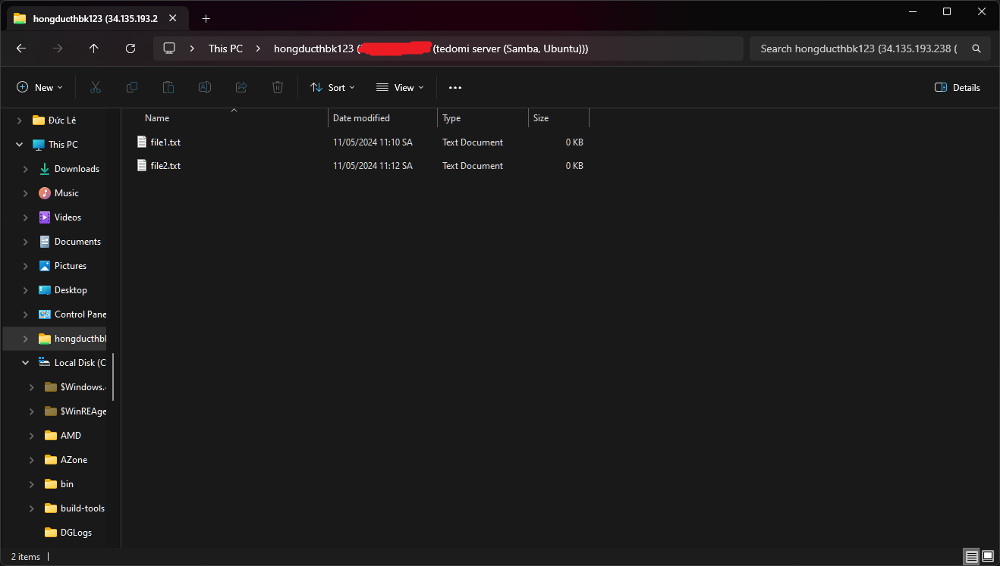

# Requirements

- Cài đặt `samba`, thêm người dùng `user1`, `user2` có quyền đăng nhập vào `samba` với quyền như sau: `user1` có quyền `read`, `user2` có quyền `write`

- Đăng nhập vào `samba` với tài khoản `user1` để tải 1 file về máy cục bộ, với tài khoản `user2` để upload 1 file lên server


# Solutions 


## Commands


### Prerequisites

Install Samba

```sh
sudo apt install samba
sudo apt install smbclient
```

### Command 1


Create Samba account for users: `user1`, `user2`

```sh
sudo useradd user1 -m -s /bin/bash
sudo smbpasswd -a user1
sudo useradd user2 -m -s /bin/bash
sudo smbpasswd -a user2
```


### Command 2

Config `smb` file

```sh
sudo nano /etc/samba/smb.conf
```

File content

```sh
[global]
   security = user
   workgroup = WORKGROUP

...

[hongducthbk123]
   comment = smb server
   path = /home/share
   browsable = yes
   guest ok = yes
   read only = no
   create mask = 0777
   valid users=user1,user2
   read list = user1
   write list = user2
   public = yes
```

Restart service after configuration

```sh
sudo systemctl restart smbd.service nmbd.service
```

### Command 3
Create share directory

```sh
sudo mkdir /home/share
sudo chmod 777 /home/share
sudo chown nobody:nogroup /home/share
```

### Command 3

Login as users: `user1`, `user2`

```sh
smbclient //127.0.0.1/hongducthbk123 -U user1
smbclient //127.0.0.1/hongducthbk123 -U user2
```

<a name="command-4"/>

### Command 4 [↑](#bookmarks) [↓](#result-4)

Download file for `user1`

```sh
get file1.txt
```

Upload file for `user2`

```sh
put file3.txt
```


## Results


### Result of Command 1 [↑](#command-1)


```sh
❯ sudo useradd user1 -m -s /bin/bash
❯ sudo smbpasswd -a user1
New SMB password: 
Retype new SMB password: 
Added user user1
```

```sh
❯ sudo useradd user2 -m -s /bin/bash
❯ sudo smbpasswd -a user2
New SMB password: 
Retype new SMB password: 
Added user user2
```


### Result of Command 2 [↑](#command-2)


```sh
❯ sudo systemctl status smbd.service 
● smbd.service - Samba SMB Daemon
     Loaded: loaded (/usr/lib/systemd/system/smbd.service; enabled; preset: enabled)
     Active: active (running) since Sat 2024-05-11 03:30:32 UTC; 35min ago
       Docs: man:smbd(8)
             man:samba(7)
             man:smb.conf(5)
    Process: 60775 ExecCondition=/usr/share/samba/is-configured smb (code=exited, status=0/SUCCESS)
   Main PID: 60777 (smbd)
     Status: "smbd: ready to serve connections..."
      Tasks: 4 (limit: 1141)
     Memory: 15.7M (peak: 35.0M)
        CPU: 859ms
     CGroup: /system.slice/smbd.service
             ├─60777 /usr/sbin/smbd --foreground --no-process-group
             ├─60781 "smbd: notifyd" .
             ├─60782 "smbd: cleanupd "
             └─60790 "smbd: client [171.224.179.10]"

May 11 03:30:32 tedomi.us-central1-a.c.test-project-389701.internal systemd[1]: Starting smbd.service - Samba SMB Daemo>
May 11 03:30:32 tedomi.us-central1-a.c.test-project-389701.internal (smbd)[60777]: smbd.service: Referenced but unset e>
May 11 03:30:32 tedomi.us-central1-a.c.test-project-389701.internal systemd[1]: Started smbd.service - Samba SMB Daemon.
May 11 03:30:41 tedomi.us-central1-a.c.test-project-389701.internal smbd[60788]: pam_unix(samba:session): session opene>
May 11 03:30:59 tedomi.us-central1-a.c.test-project-389701.internal smbd[60790]: pam_unix(samba:session): session opene>
May 11 03:34:39 tedomi.us-central1-a.c.test-project-389701.internal smbd[60788]: pam_unix(samba:session): session close>
lines 1-24/24 (END)
```


### Result of Command 3 [↑](#command-3)

```sh
❯ smbclient //127.0.0.1/hongducthbk123 -U user1
Password for [WORKGROUP\user1]:
Try "help" to get a list of possible commands.
smb: \> 
```

```sh
❯ smbclient //127.0.0.1/hongducthbk123 -U user2
Password for [WORKGROUP\user2]:
Try "help" to get a list of possible commands.
smb: \> 
```
<a name="result-4"/>

### Result of Command 4 [↑](#command-4)

```sh
❯ smbclient //127.0.0.1/hongducthbk123 -U user1
Password for [WORKGROUP\user1]:
Try "help" to get a list of possible commands.
smb: \> l
  .                                   D        0  Sat May 11 04:10:35 2024
  ..                                  D        0  Sat May 11 04:10:35 2024
  file1.txt                           N        0  Sat May 11 04:10:35 2024

                28362944 blocks of size 1024. 23399796 blocks available
smb: \> get file1.txt
getting file \file1.txt of size 0 as file1.txt (0.0 KiloBytes/sec) (average 0.0 KiloBytes/sec)
smb: \> exit
```

```sh
❯ smbclient //127.0.0.1/hongducthbk123 -U user2
Password for [WORKGROUP\user2]:
Try "help" to get a list of possible commands.
smb: \> l
  .                                   D        0  Sat May 11 04:10:35 2024
  ..                                  D        0  Sat May 11 04:10:35 2024
  file1.txt                           N        0  Sat May 11 04:10:35 2024

                28362944 blocks of size 1024. 23399796 blocks available
smb: \> put file2.txt
putting file file2.txt as \file2.txt (0.0 kb/s) (average 0.0 kb/s)
smb: \> l
  .                                   D        0  Sat May 11 04:12:26 2024
  ..                                  D        0  Sat May 11 04:12:26 2024
  file2.txt                           A        0  Sat May 11 04:12:26 2024
  file1.txt                           N        0  Sat May 11 04:10:35 2024

                28362944 blocks of size 1024. 23399796 blocks available
smb: \> exit
❯ 
```

## Bonus


