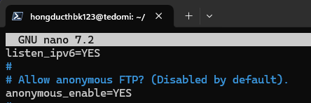
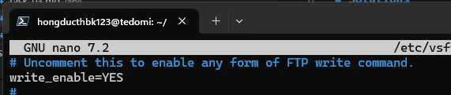
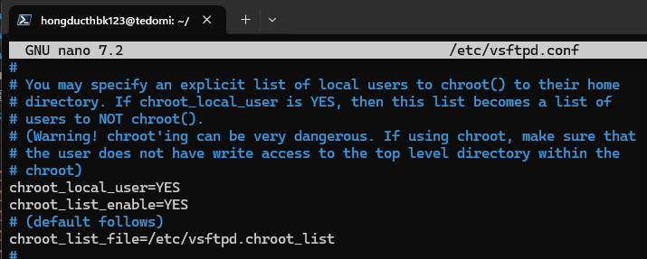

# Requirements

Đăng nhập vào ftp server với tài khoản ftp và tài khoản người dùng thông thường, thực hiện các thao tác upload/download dữ liệu (với người dùng thông thường có thêm tuỳ chọn YES và NO với chroot_local_user)


# Solutions 


## Commands


### Prerequisites

Install vsftpd

```sh
sudo apt install vsftpd
```

### Command 1


Configure ftp daemon

```sh
sudo nano /etc/vsftpd.conf
```

File content:
```
anonymous_enable=YES
write_enable=YES
chroot_local_user=YES
chroot_list_enable=YES
chroot_list_file=/etc/vsftpd.chroot_list
```

Add user to chroot list

```sh
echo $USER | sudo tee /etc/vsftpd.chroot_list -a
```

Restart service after configuration

```sh
sudo systemctl restart vsftpd.service
```

### Command 2

Login to ftp server

```sh
ftp 127.0.0.1
```
Note: User `ftp` doesn't have password
### Command 3
To upload file:

```sh
put file.txt
```

To download file:
```sh
get file.txt
```


## Results


### Result of Command 1 






### Result of Command 2 & 3

```sh
❯ ftp 127.0.0.1
Connected to 127.0.0.1.
220 (vsFTPd 3.0.5)
Name (127.0.0.1:hongducthbk123): hongducthbk123
331 Please specify the password.
Password:
230 Login successful.
Remote system type is UNIX.
Using binary mode to transfer files.
ftp> ls
229 Entering Extended Passive Mode (|||45680|)
150 Here comes the directory listing.
drwxrwxr-x    5 1001     988          4096 May 02 10:22 EsportsHelper
-rw-rw-r--    1 1001     1002            0 May 25 03:42 hehe.txt
drwxrwxrwx    2 65534    65534        4096 May 25 03:43 share
drwx------    3 1001     1002         4096 May 02 10:13 snap
226 Directory send OK.
ftp> put file.txt
local: file.txt remote: file.txt
229 Entering Extended Passive Mode (|||11778|)
150 Ok to send data.
     0        0.00 KiB/s
226 Transfer complete.
ftp> get hehe.txt
local: hehe.txt remote: hehe.txt
229 Entering Extended Passive Mode (|||46741|)
150 Opening BINARY mode data connection for hehe.txt (0 bytes).
     0        0.00 KiB/s
226 Transfer complete.
ftp>
```

```sh
❯ ftp 127.0.0.1
Connected to 127.0.0.1.
220 (vsFTPd 3.0.5)
Name (127.0.0.1:hongducthbk123): ftp
331 Please specify the password.
Password:
230 Login successful.
Remote system type is UNIX.
Using binary mode to transfer files.
ftp> ls
229 Entering Extended Passive Mode (|||11269|)
150 Here comes the directory listing.
-rw-r--r--    1 0        0               0 May 25 04:13 hehehe.txt
226 Directory send OK.
ftp> get hehehe.txt
local: hehehe.txt remote: hehehe.txt
229 Entering Extended Passive Mode (|||29673|)
150 Opening BINARY mode data connection for hehehe.txt (0 bytes).
     0        0.00 KiB/s
226 Transfer complete.
ftp>
```
