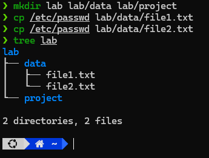

# Requirements
Hãy sử dụng những lệnh đã biết ở bài 2 để tạo cấu trúc thư mục sau bằng số lệnh ít nhất có thể, số lần gõ bàn phím ít nhất có thể:

```
/-
  |-/lab

    |-/data

    | |- file1.txt

    | |- file2.txt

    |-/project
```
Lưu ý: Các file được tạo có nội dung được chép từ file `/etc/passwd`.

# Solution

## Commands

### Command 1

```sh
mkdir lab lab/data lab/project
```

### Command 2

```sh
cp /etc/passwd lab/data/file1.txt
```

### Command 3

```sh
cp /etc/passwd lab/data/file2.txt
```

## Results

### Command 1

```sh
❯ mkdir lab lab/data lab/project
❯ tree lab
lab
├── data
└── project

2 directories, 0 files
```

### Command 2

```sh
❯ sudo cp /etc/passwd lab/data/file1.txt
❯ tree lab
lab
├── data
│   └── file1.txt
└── project

2 directories, 1 files
```

### Command 3

```sh
❯ mkdir lab lab/data lab/project
❯ cp /etc/passwd lab/data/file1.txt
❯ cp /etc/passwd lab/data/file2.txt
❯ tree lab
lab
├── data
│   ├── file1.txt
│   └── file2.txt
└── project

2 directories, 2 files
```
