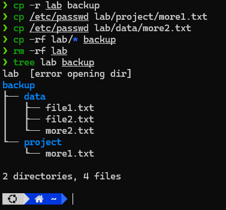

# Requirements

- Hãy sao chép thư mục `/lab` ở bài 3 thành thư mục `/backup` **(lưu ý thư mục `/backup` chưa tồn tại)** sau đó tạo thêm hai file có nội dung giống như hai file trước có tên là `/lab/project/more1.txt`  và  `/lab/data/more2.txt`.
- Lại sao chép thư mục `/lab` ở trên thành thư mục `/backup` **(lưu ý lúc này đã có thư mục này)** với yêu cầu là không phải trả lời các câu hỏi có ghi đè không mà ghi đè trực tiếp không hỏi, sau đó xóa thư mục `/lab`.

# Solution

## Commands

### Command 1

```sh
cp -r lab backup
```

### Command 2

```sh
cp /etc/passwd lab/project/more1.txt
```

### Command 3

```sh
cp /etc/passwd lab/data/more2.txt
```

### Command 4

```sh
cp -rf lab/* backup
```

### Command 5

```sh
rm -rf lab
```

# Results

## Commands

### Command 1

```sh
❯ cp -r lab backup
❯ tree backup
backup
├── data
│   ├── file1.txt
│   └── file2.txt
└── project

2 directories, 2 files
```

### Command 2

```sh
❯ cp /etc/passwd lab/project/more1.txt
❯ tree lab
lab
├── data
│   ├── file1.txt
│   └── file2.txt
└── project
    └── more1.txt

2 directories, 3 files
```

### Command 3

```sh
❯ cp /etc/passwd lab/data/more2.txt
❯ tree lab
lab
├── data
│   ├── file1.txt
│   ├── file2.txt
│   └── more2.txt
└── project
    └── more1.txt

2 directories, 4 files
```

### Command 4

```sh
❯ cp -rf lab/* backup
❯ tree backup
backup
├── data
│   ├── file1.txt
│   ├── file2.txt
│   └── more2.txt
└── project
    └── more1.txt

2 directories, 4 files
```

### Command 5

```sh
❯ rm -rf lab
❯ tree lab
lab  [error opening dir]

0 directories, 0 files
```
