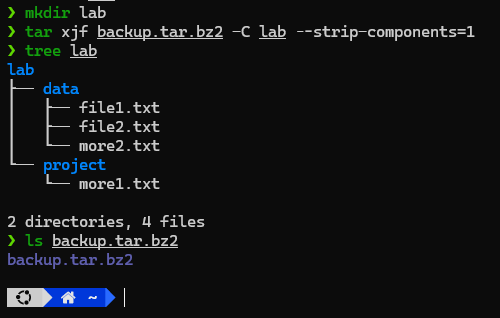

# Requirements

Tạo file  `/root/backup.tar.bz2`  là bản backup dạng nén của thư mục backup trong bài 4. 
Sau đó giải nén file này thành thư mục  `/lab`  với cấu trúc thư mục như  `/backup`.

# Solution

## Commands

### Zipping

```sh
tar cjf backup.tar.bz2 backup
```

### Unzipping

```sh
mkdir lab
tar xjf backup.tar.bz2 -C lab --strip-components=1
```

## Results

### Zipping

```sh
❯ ls backup.tar.bz2
ls: cannot access 'backup.tar.bz2': No such file or directory
❯ tar cjf backup.tar.bz2 backup
❯ ls backup.tar.bz2
backup.tar.bz2
```

### Unzipping

```sh
❯ mkdir lab
❯ tar xjf backup.tar.bz2 -C lab --strip-components=1
❯ tree lab
lab
├── data
│   ├── file1.txt
│   ├── file2.txt
│   └── more2.txt
└── project
    └── more1.txt

2 directories, 4 files
```
