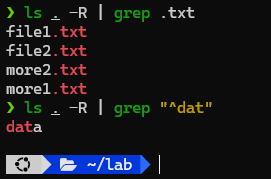

# Requirements

- Sử dụng lệnh `ls` để liệt kê tất cả các file/thư mục trong hệ thống file tính từ thư mục gốc “`/`” sau đó dùng lệnh `grep` để lọc ra tất cả các file có phần đuôi là “`.txt`”

- Cũng yêu cầu trên, làm lại nhưng lọc kết quả là các file có phần đầu là “`dat`”.

# Solution

## Commands

### Command 1

```sh
ls / -R | grep .txt
```

### Command 2

```sh
ls / -R | grep "^dat"
```

## Results

### Command 1

```sh
❯ ls / -R | grep .txt
file1.txt
file2.txt
more2.txt
more1.txt
...
```

### Command 2

```sh
❯ ls / -R | grep "^dat"
data
data2.txt
...
```

