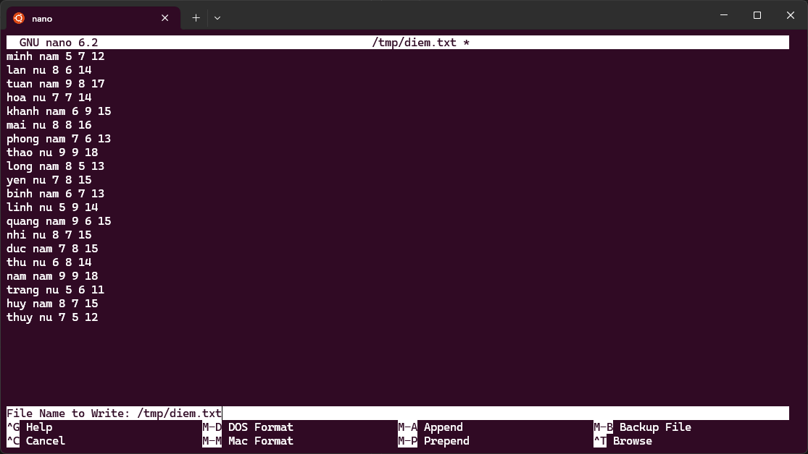

# Requirements

Tạo file `/tmp/diem.txt` có tối thiểu 20 với các yêu cầu sau

+ Mỗi dòng có 5 trường thể hiện các nội dung về (Tên, Giới tính, Điểm 1, Điểm 2, Điểm Tổng)

+ Tổng = Điểm 1 + Điểm 2 (các giá trị này là nguyên dương)

+ Tên không giống nhau với mỗi dòng và không bao gồm dấu cách. Lưu ý, Tên chứ không phải Họ và Tên

+ Mỗi trường cách nhau bằng đúng một dấu cách, mỗi dòng có đúng 4 dấu cách

+ Giới tính có hai loại là nam và nữ

+ Tất cả các ký tự trong file đều là chữ thường, không có dấu.

# Solution
## Commands
### Command 1
```bash
nano /tmp/diem.txt
```
### File content
```plaintext
minh nam 5 7 12
lan nu 8 6 14
tuan nam 9 8 17
hoa nu 7 7 14
khanh nam 6 9 15
mai nu 8 8 16
phong nam 7 6 13
thao nu 9 9 18
long nam 8 5 13
yen nu 7 8 15
binh nam 6 7 13
linh nu 5 9 14
quang nam 9 6 15
nhi nu 8 7 15
duc nam 7 8 15
thu nu 6 8 14
nam nam 9 9 18
trang nu 5 6 11
huy nam 8 7 15
thuy nu 7 5 12
```
Ctrl + X -> Y -> Enter để lưu file và thoát khỏi nano

Screenshot:



