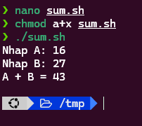
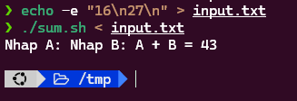

# Requirements

### Requirement 1

Chạy lệnh sau  `cat > /tmp/new.txt`  gõ một số đoạn ký tự có xuống dòng rồi nhấn <kbd>Ctrl</kbd>+<kbd>D</kbd> để kết thúc nhập. </br> 
Giải thích các thao tác trên

### Requirement 2

Tạo file `sum.sh` có nội dung như sau:

```sh
echo -n "Nhap A: "; read A
echo -n "Nhap B: "; read B
echo "A + B = $(($A + $B))"
```

Sau đó thực hiện các lệnh sau để chạy file mới tạo

```sh
chmod a+x sum.sh
./sum.sh
```

Nhập A, B bằng bàn phím để tính A + B. </br>
Sau đó tạo file `input.txt` có nội dung như sau (lưu ý có 3 dòng, dòng thứ 3 trống)

```sh
16
27

```

Sau đó chạy lệnh sau để kiểm tra chuyển hướng đầu vào (`stdin`)

```sh
./sum.sh < input.txt
```
# Solution
## Commands
### Requirement 1
- Command `cat` không có argument -> tự chọn `stdin` là bàn phím để lấy dữ liệu vào
- Operator `>` redirect dữ liệu từ command trên để ghi vào file `new.txt`
- Các dòng dữ liệu do người dùng nhập từ bàn phím chính là `stdin`
- <kbd>Ctrl</kbd>+<kbd>D</kbd> để chèn ký tự `EOF` (end of file) báo hiệu kết thúc file
- Nội dung từ `stdin` được ghi vào file `new.txt`

### Requirement 2
#### Command 1
```sh
nano sum.sh
```
```sh
echo -n "Nhap A: "; read A
echo -n "Nhap B: "; read B
echo "A + B = $(($A + $B))"
```

#### Command 2
```sh
chmod a+x sum.sh
./sum.sh
```
Screenshot: 



#### Command 3
```sh
echo -e "16\n27\n" > input.txt
./sum.sh < input.txt
```
Screenshot: 

