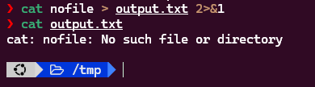
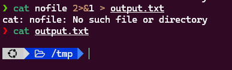

# Requirements

Chạy lệnh sau để đảm bảo không có file `nofile` `rm –f nofile`  sau đó lần lượt chạy các lệnh sau

```sh
cat nofile > output.txt 2>&1
cat nofile 2>&1 > output.txt
```

Hãy giải thích các hiện tượng diễn ra trên màn hình và nội dung file `output.txt`

# Solution

## Commands

### Command 1

```sh
cat nofile > output.txt 2>&1
```

### Command 2

```sh
cat nofile 2>&1 > output.txt
```

## Solution

### Command 1

```sh
❯ cat nofile > output.txt 2>&1
❯ cat output.txt
cat: nofile: No such file or directory
```



- Không tồn tại file `nofile` nên command `cat` báo lỗi ra `stderr`
- Operator `>` đầu tiên sẽ redirect nội dung từ `stdout` vào file
`output.txt`
- Operator `2>&1` thứ hai sẽ redirect thông báo lỗi từ `stderr` ra nơi `stdout` đang được định hướng, mà
ở đây `stdout` đã redirect vào file `output.txt` rồi
- Kiểm tra nội dung file `output.txt` ta sẽ thấy thông báo lỗi của command ban đầu

### Command 2

```sh
❯ cat nofile 2>&1 > output.txt
cat: nofile: No such file or directory
❯ cat output.txt

```


- Không tồn tại file `nofile` nên command `cat` báo lỗi ra `stderr`
- Operator `2>&1` đầu tiên sẽ chuyển hướng thông báo lỗi từ `stderr` ra nơi `stdout` đang được định hướng là màn hình console
- Sau đó operator `>` thứ hai sẽ chuyển hướng  `stdout` vào file
`output.txt`, nhưng ở đây `stdout` đang trống vì không có lỗi nào được in ra `stdout`
- Kiểm tra nội dung file `output.txt` ta sẽ thấy rỗng