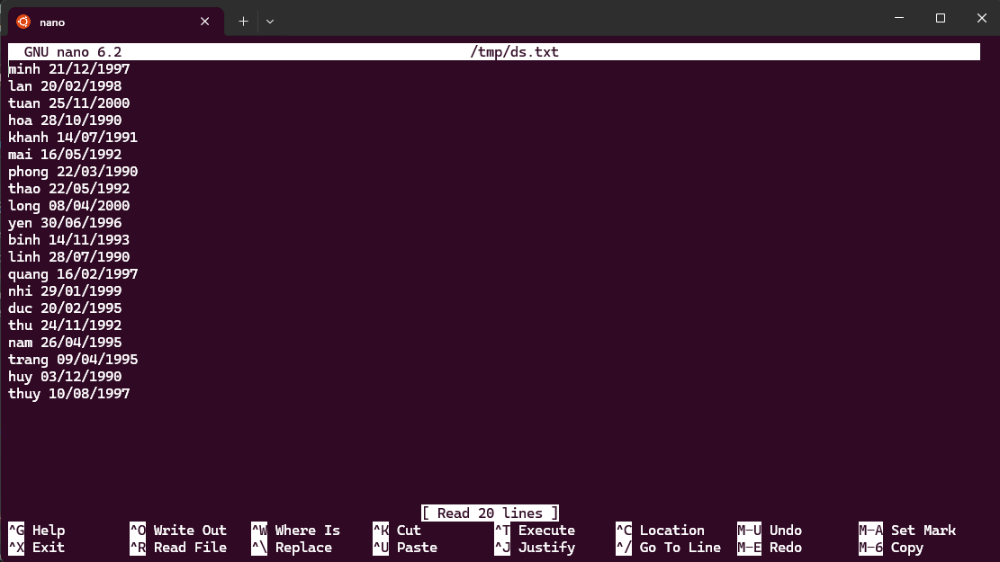

# Requirements

- Hiển thị danh sách trong file `/tmp/diem.txt` theo thứ tự tăng dần của Tên

- Hiển thị danh sách trên theo tứ tự tăng dần của Tổng điểm

- Đếm số bạn nam, nữ trong file

- Tạo thêm file `/tmp/ds.txt` có hai trường Tên, Ngày sinh có số dòng và Tên như trong file `/tmp/diem.txt`. Hãy tạo file `/tmp/full.txt` chứa nội dung hai file trước nhưng cột Ngày sinh nằm sau cột Giới tính

# Solution

## Commands

### Command 1

```sh
cat /tmp/diem.txt | sort
```

### Command 2

```sh
cat /tmp/diem.txt | sort -k5n
```

### Command 3

```sh
cat /tmp/diem.txt | grep " nam" | wc -l
```

### Command 4

```sh
cat /tmp/diem.txt | grep " nu" | wc -l
```

### Command 5

```sh
nano /tmp/ds.txt
```

### Command 6

```sh
paste -d ' ' diem.txt ds.txt | awk '{print $1, $2, $7, $3, $4, $5}' > /tmp/full.txt
```


## Solution

### Command 1

```sh
❯ cat /tmp/diem.txt | sort
binh nam 6 7 13
duc nam 7 8 15
hoa nu 7 7 14
huy nam 8 7 15
khanh nam 6 9 15
lan nu 8 6 14
linh nu 5 9 14
long nam 8 5 13
mai nu 8 8 16
minh nam 5 7 12
nam nam 9 9 18
nhi nu 8 7 15
phong nam 7 6 13
quang nam 9 6 15
thao nu 9 9 18
thu nu 6 8 14
thuy nu 7 5 12
trang nu 5 6 11
tuan nam 9 8 17
yen nu 7 8 15
```

### Command 2

```sh
❯ cat /tmp/diem.txt | sort -k5n
trang nu 5 6 11
minh nam 5 7 12
thuy nu 7 5 12
binh nam 6 7 13
long nam 8 5 13
phong nam 7 6 13
hoa nu 7 7 14
lan nu 8 6 14
linh nu 5 9 14
thu nu 6 8 14
duc nam 7 8 15
huy nam 8 7 15
khanh nam 6 9 15
nhi nu 8 7 15
quang nam 9 6 15
yen nu 7 8 15
mai nu 8 8 16
tuan nam 9 8 17
nam nam 9 9 18
thao nu 9 9 18
```

### Command 3

```sh
❯ cat /tmp/diem.txt | grep " nam" | wc -l
10
```

### Command 4

```sh
❯ cat /tmp/diem.txt | grep " nu" | wc -l
10
```

### Command 5

```sh
❯ nano /tmp/ds.txt
```


### Command 6

```sh
❯ paste -d ' ' diem.txt ds.txt | awk '{print $1, $2, $7, $3, $4, $5}' > /tmp/full.txt
❯ cat /tmp/full.txt
minh nam 21/12/1997 5 7 12
lan nu 20/02/1998 8 6 14
tuan nam 25/11/2000 9 8 17
hoa nu 28/10/1990 7 7 14
khanh nam 14/07/1991 6 9 15
mai nu 16/05/1992 8 8 16
phong nam 22/03/1990 7 6 13
thao nu 22/05/1992 9 9 18
long nam 08/04/2000 8 5 13
yen nu 30/06/1996 7 8 15
binh nam 14/11/1993 6 7 13
linh nu 28/07/1990 5 9 14
quang nam 16/02/1997 9 6 15
nhi nu 29/01/1999 8 7 15
duc nam 20/02/1995 7 8 15
thu nu 24/11/1992 6 8 14
nam nam 26/04/1995 9 9 18
trang nu 09/04/1995 5 6 11
huy nam 03/12/1990 8 7 15
thuy nu 10/08/1997 7 5 12
```