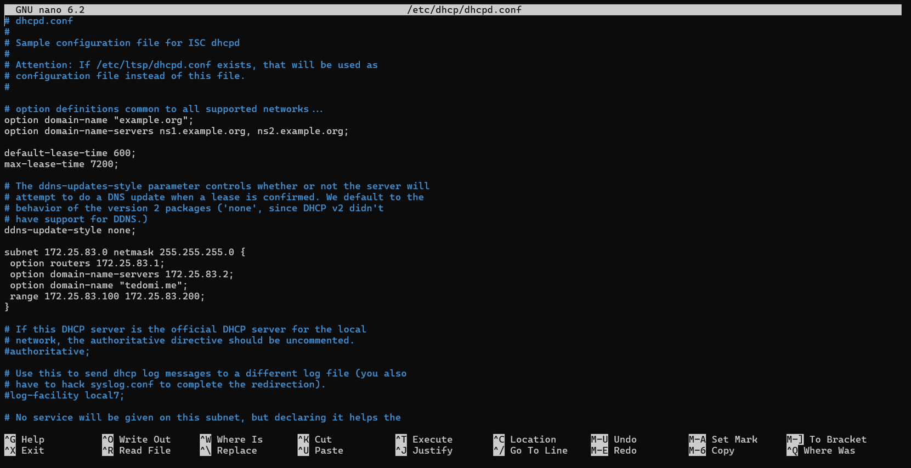
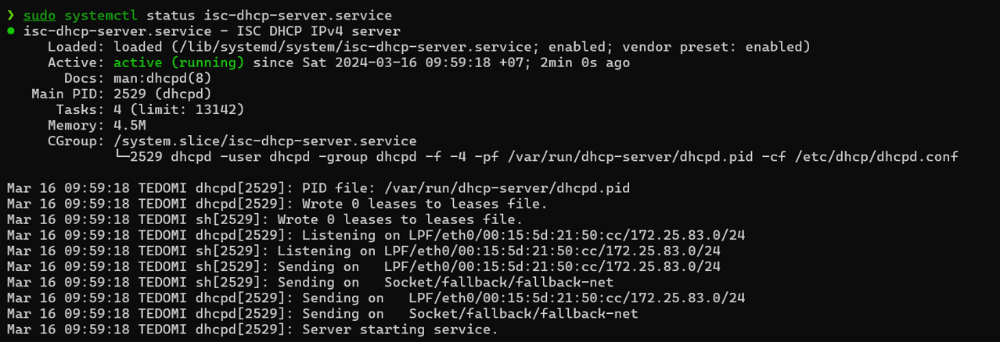

# Requirements

Thiết lập DHCP server trên các máy tính (`172.16.2.1`, `172.16.3.1`, `172.16.4.1`, `172.16.5.1`) sao cho:

\-          Chỉ lắng nghe yêu cầu trên mạng con (`192.168....`)

\-          Ngoài `IP/Subnetmask` còn cung cấp các thông số về `gateway`, `dns`, `dns postfix`.

# Solution

## Commands

### Command 1

```sh
ifconfig -a
```

### Command 2

```sh
sudo nano /etc/dhcp/dhcpd.conf
```

### File content

```conf
subnet 172.25.83.0 netmask 255.255.255.0 {
 option routers 172.25.83.1;
 option domain-name-servers 172.25.83.2;
 option domain-name "tedomi.me";
 range 172.25.83.100 172.25.83.200; 
}
```

### Command 3

```sh
sudo systemctl restart isc-dhcp-server.service
```

### Command 4

```sh
sudo systemctl status isc-dhcp-server.service
```

## Solution

### Command 1

```sh
❯ ifconfig -a
enp0s3: flags=4163<UP,BROADCAST,RUNNING,MULTICAST>  mtu 1500
        inet 172.25.83.15  netmask 255.255.255.0  broadcast 172.25.83.255
        ether 00:15:5d:c0:d3:1e  txqueuelen 1000  (Ethernet)
        RX packets 46  bytes 13502 (13.5 KB)
        RX errors 0  dropped 0  overruns 0  frame 0
        TX packets 91  bytes 11321 (11.3 KB)
        TX errors 0  dropped 0 overruns 0  carrier 0  collisions 0

lo: flags=73<UP,LOOPBACK,RUNNING>  mtu 65536
        inet 127.0.0.1  netmask 255.0.0.0
        loop  txqueuelen 1000  (Local Loopback)
        RX packets 114  bytes 9644 (9.6 KB)
        RX errors 0  dropped 0  overruns 0  frame 0
        TX packets 114  bytes 9644 (9.6 KB)
        TX errors 0  dropped 0 overruns 0  carrier 0  collisions 0
```

### Command 2



### Command 3

```sh
❯ sudo systemctl restart isc-dhcp-server.service
❯
```

### Command 4

