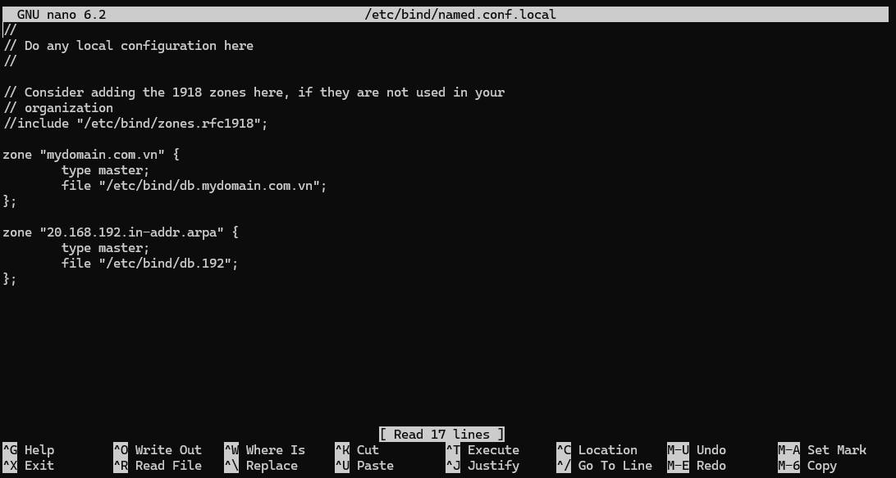
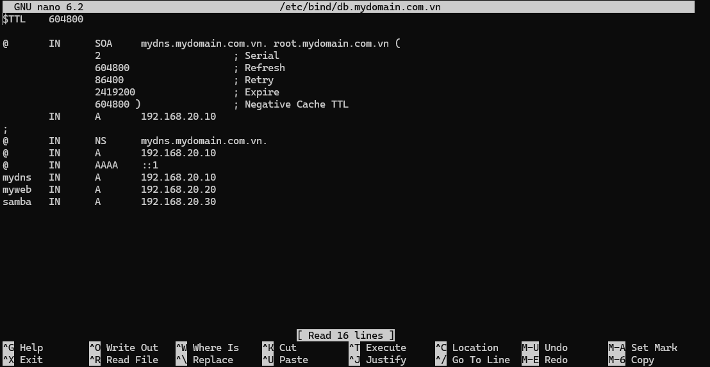
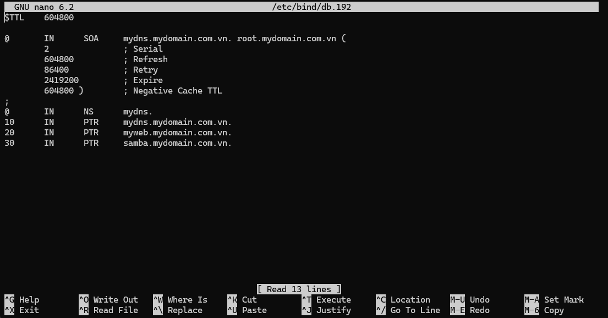
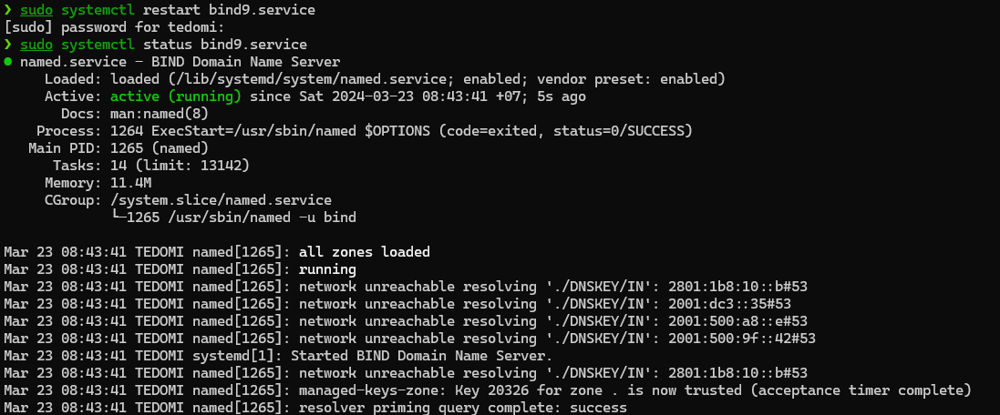
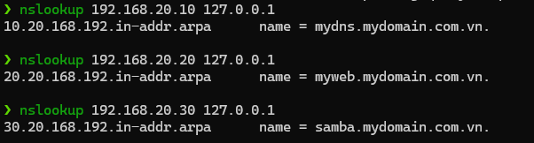

# Requirements

Cấu hình DNS phân giải tên miền “mydomain.com.vn”, có các server  sau:

\-         DNS Server: `mydns.mydomain.com.vn`; IP: `192.168.20.10/24`

\-         Web Server: `myweb.mydomain.com.vn`; IP: `192.168.20.20/24`

\-         Samba Server: `samba.mydomain.com.vn`; IP: `192.168.30.30/24`

# Solution

## Commands

## Prerequisites

Install `BIND`(*Berkeley Internet Name Distributed*)

```sh
sudo apt install bind9 dnsutils
```

### Command 1

```sh
sudo vi /etc/bind/named.conf.local
```

### File content

```conf
zone "mydomain.com.vn" {
        type master;
        file "/etc/bind/db.mydomain.com.vn";
};

zone "20.168.192.in-addr.arpa" {
        type master;
        file "/etc/bind/db.192";
};
```

### Command 2

```sh
sudo vi /etc/bind/db.mydomain.com.vn
```

### File content

```conf
$TTL    604800

@       IN      SOA     mydns.mydomain.com.vn. root.mydomain.com.vn (
                2                       ; Serial
                604800                  ; Refresh
                86400                   ; Retry
                2419200                 ; Expire
                604800 )                ; Negative Cache TTL
        IN      A       192.168.20.10
;
@       IN      NS      mydns.mydomain.com.vn.
@       IN      A       192.168.20.10
@       IN      AAAA    ::1
mydns   IN      A       192.168.20.10
myweb   IN      A       192.168.20.20
samba   IN      A       192.168.20.30
```

### Command 3

```sh
sudo vi /etc/bind/db.192
```

### File content

```conf
$TTL    604800

@       IN      SOA     mydns.mydomain.com.vn. root.mydomain.com.vn (
        2               ; Serial
        604800          ; Refresh
        86400           ; Retry
        2419200         ; Expire
        604800 )        ; Negative Cache TTL
;
@       IN      NS      mydns.
10      IN      PTR     mydns.mydomain.com.vn.
20      IN      PTR     myweb.mydomain.com.vn.
30      IN      PTR     samba.mydomain.com.vn.
```

### Command 4

```sh
sudo systemctl restart bind9.service
```

### Command 5

```sh
sudo systemctl status bind9.service
```

### Command 6

```sh
nslookup 192.168.20.10 127.0.0.1
```

### Command 7

```sh
nslookup 192.168.20.20 127.0.0.1
```

### Command 8

```sh
nslookup 192.168.20.30 127.0.0.1
```

## Solution

### Command 1



### Command 2




### Command 3



### Command 4

```sh
❯ sudo systemctl restart bind9.service
```

### Command 5



### Command 6-8

