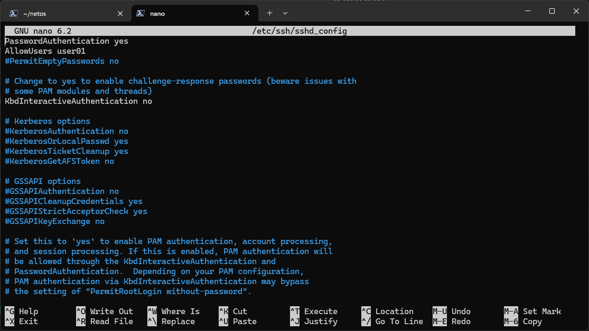
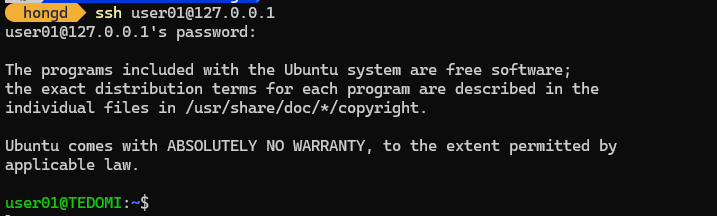

# Requirements

Giả sử, quản trị mạng **A** được giao nhiệm vụ quản trị các máy server **R01**, **R02**. Tuy nhiên, **A** không thể vào phòng server để sử dụng bàn phím/chuột trực tiếp. **A** quyết định sử dụng `SSH` để quản trị các máy tính này từ xa. Để đảm bảo an toàn, tránh các phần mềm KeyLog có thể vô tình bị nhiễm, **A** quyết định sử dụng cơ chế xác thực thông qua bộ khóa công khai của người dùng theo cơ chế `RSA`.

- Trên server `R01`, tạo tài khoản `user01` và cấu hình server này sao cho từ các máy tính khác có thể đăng nhập từ xa chỉ bằng tài khoản của `user01` thông qua dịch vụ `SSH`.

# Prerequisites

Install OpenSSH on both `client` and `server`

## Server - Linux

```sh
sudo apt install openssh-server
```

# Solution

## Commands

### Command 1 - Server

Add **user01** to server system

```sh
sudo adduser user01
```

### Command 2 - Server 

Modify SSH configuration file

```sh
sudo nano /etc/ssh/sshd_config
```

File Content

```sh
...

PasswordAuthentication yes
AllowUsers user01
...
```

Restart service after file changes

```sh
sudo systemctl restart ssh
```

### Command 3 - Client

SSH to server from client

```sh
ssh 'user01@127.0.0.1'
```


## Results


### Command 1 - Server

```sh
❯ sudo adduser user01
Adding user `user01' ...
Adding new group `user01' (1001) ...
Adding new user `user01' (1001) with group `user01 (1001)' ...
Creating home directory `/home/user01' ...
Copying files from `/etc/skel' ...
New password: 
Retype new password: 
passwd: password updated successfully
Changing the user information for user01
Enter the new value, or press ENTER for the default
	Full Name []: user01
	Room Number []: 
	Work Phone []: 
	Home Phone []: 
	Other []: 
Is the information correct? [Y/n] y
Adding new user `user01' to supplemental / extra groups `users' ...
Adding user `user01' to group `users' ...
```

### Command 2 - Server 



### Command 3 - Client


