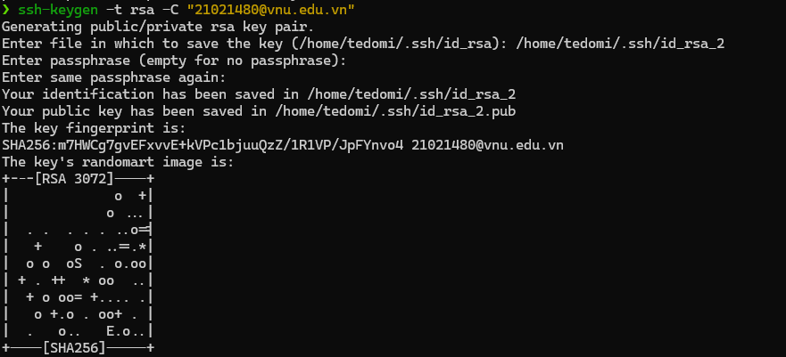
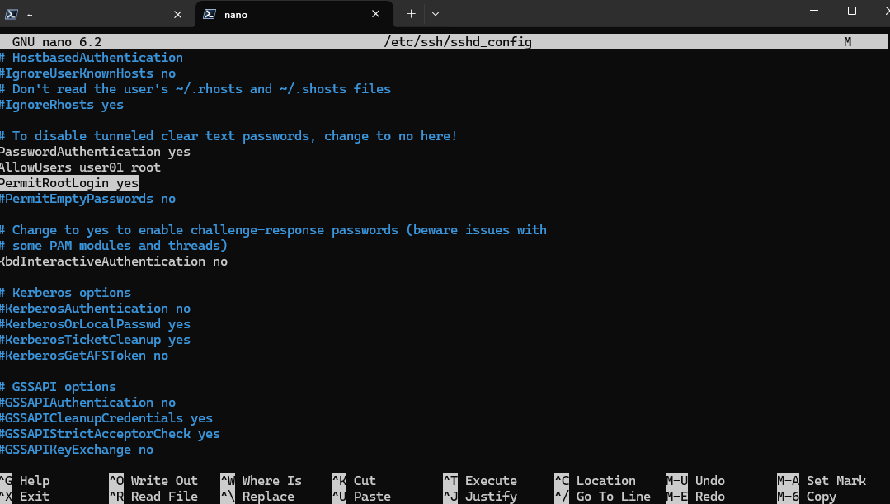
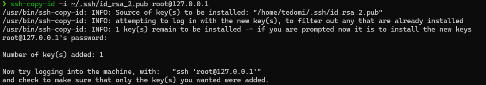
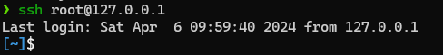

# Requirements

Giả sử, quản trị mạng **A** được giao nhiệm vụ quản trị các máy server **R01**, **R02**. Tuy nhiên, **A** không thể vào phòng server để sử dụng bàn phím/chuột trực tiếp. **A** quyết định sử dụng `SSH` để quản trị các máy tính này từ xa. Để đảm bảo an toàn, tránh các phần mềm KeyLog có thể vô tình bị nhiễm, **A** quyết định sử dụng cơ chế xác thực thông qua bộ khóa công khai của người dùng theo cơ chế `RSA`.

- Hãy thiết lập server `R02` sao cho máy tính PC có khả năng đăng nhập từ xa như `root` thông qua `SSH` vào server trên mà **không cần mật khẩu**.

# Prerequisites

Install OpenSSH on both `client` and `server`

## Server - Linux

```sh
sudo apt install openssh-server
```

# Solution

## Commands

### Command 1 - Server

Activate **root** user

```sh
sudo passwd root
```

### Command 2 - Client

Generate keys for client

```sh
ssh-keygen -t rsa -C "21021480@vnu.edu.vn"
```

### Command 3 - Server

Modify SSH configuration file

```sh
sudo nano /etc/ssh/sshd_config
```

File Content

```sh
...

PubkeyAuthentication yes
AllowUsers user01 root
PermitRootLogin yes

...
```

Restart service after file changes

```sh
sudo systemctl restart ssh
```

### Command 4 - Client

Send client's public key to server

```sh
ssh-copy-id -i ~/.ssh/id_rsa.pub root@127.0.0.1 
```

### Command 5 - Client

SSH to server from client

```sh
ssh 'root@127.0.0.1'
```

## Result


### Command 1 - Server

```sh
❯ sudo passwd root
New password: 
Retype new password: 
passwd: password updated successfully
```

### Command 2 - Client





### Command 3 - Server



### Command 4 - Client 





### Command 5 - Client 

