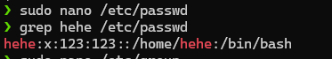
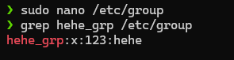
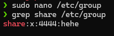

# Requirements

- Thêm một người dùng vào hệ thống bằng cách soạn thảo `/etc/passwd` và `/etc/group`.

- Tạo một nhóm có tên là `share` và thêm người dùng `tux` vào nhóm này bằng cách soạn thảo bằng tay `/etc/group`.

<a name="solutions"/>

# Solution

<a name="commands"/>

## Commands

<a name="command-1"/>

### Command 1 [↑](#bookmarks) [↓](#result-1)

Add new line in `/etc/passwd`

```sh
sudo nano /etc/passwd
```

File content

```sh
hehe:x:123:123::/home/hehe:/bin/bash
```

Check if user **alt_usr** added successfully

```sh
grep hehe /etc/passwd
```

<a name="command-2"/>

### Command 2 [↑](#bookmarks) [↓](#result-2)

Add new line in `/etc/group`

```sh
sudo nano /etc/group
```

File content

```sh
hehe_grp:x:2222:hehe
```

Check if group **alt_grp** added successfully

```sh
grep alt_grp /etc/group
```

<a name="command-3"/>

### Command 3 [↑](#bookmarks) [↓](#result-3)

Add new line in `/etc/group`

```sh
sudo nano /etc/group
```

File content

```sh
share:x:3333:hehe
```

Check if group **share** added with user **tux** in it successfully

```sh
grep share /etc/group
```

<a name="results"/>

## Results

<a name="result-1"/>

### Result of Command 1 [↑](#command-1)


<a name="result-2"/>

### Result of Command 2 [↑](#command-2)



<a name="result-3"/>

### Result of Command 3 [↑](#command-3)

