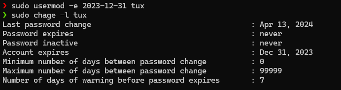
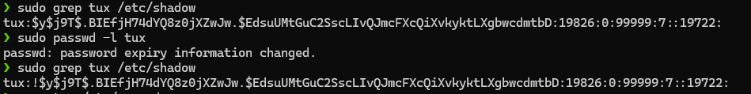
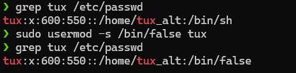
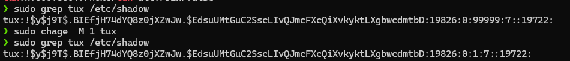

# Requirements

- Thay đổi tham số ngày hết hạn của tài khoản người dùng
`tux` bằng cách sử dụng câu lệnh `usermod`.

- Khoá tài khoản người dùng (Sử dụng các công cụ
hoặc soạn thảo file `/etc/shadow`, ...)

- Bảo vệ người dùng từ đăng nhập bằng cách thay đổi shell
mặc định của người dùng thành `/bin/false`.

- Thay đổi tham số `PASS_MAX_DAYS` của người dùng `tux`
thành 1 trong file `/etc/shadow`.

<a name="solutions"/>

# Solution

<a name="commands"/>

## Commands

<a name="command-1"/>

### Command 1 [↑](#bookmarks) [↓](#result-1)

Check previous account expire day of **tux**

```sh
sudo chage -l tux
```

Set new account expire day for **tux**

```sh
sudo usermod -e 2023-12-31 tux
```

Check current account expire day of **tux**

```sh
sudo chage -l tux
```

<a name="command-2"/>

### Command 2 [↑](#bookmarks) [↓](#result-2)

Check previous password status of **tux**

```sh
sudo grep tux /etc/shadow
```

Lock the account of **tux**

```sh
sudo passwd -l tux
```

Check current password status of **tux**

```sh
sudo grep tux /etc/shadow
```

<a name="command-3"/>

### Command 3 [↑](#bookmarks) [↓](#result-3)

Check user previous default shell

```sh
grep tux /etc/passwd
```

Change user default shell to **/bin/false**

```sh
sudo usermod -s /bin/false tux
```

Check user current default shell

```sh
grep tux /etc/passwd
```

<a name="command-4"/>

### Command 4 [↑](#bookmarks) [↓](#result-4)

Check previous **PASS_MAX_DAYS** of **tux**

```sh
sudo grep tux /etc/shadow
```

Change **PASS_MAX_DAYS** of **tux**

```sh
sudo chage -M 1 tux
```

Check current **PASS_MAX_DAYS** of **tux**

```sh
sudo grep tux /etc/shadow
```

<a name="results"/>

## Results

<a name="result-1"/>

### Result of Command 1 [↑](#command-1)


<a name="result-2"/>

### Result of Command 2 [↑](#command-2)



<a name="result-3"/>

### Result of Command 3 [↑](#command-3)



<a name="result-4"/>

### Result of Command 4 [↑](#command-4)

