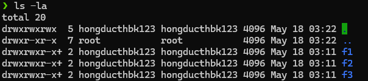
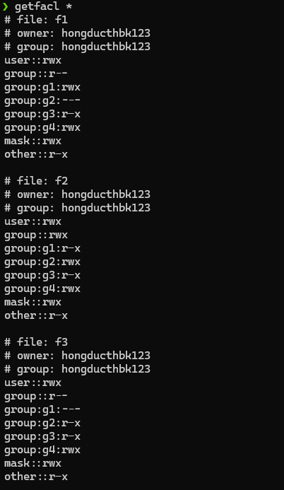

# Requirements
Tạo 4 group:

- Group 1 là g1 gồm các user: a1, a2, a3
- Group 2 là g2 gồm các user: b1, b2, b3
- Group 3 là g3 gồm các user: c1, c2, c3
- Group 4 là g4 gồm các user: d1, d2, d3

Tạo 3 folder: f1 , f2, f3

Yêu cầu phân quyền đơn giản như sau:

- Các user thuộc g1 có quyền write trên folder f1, read trên folder f2, cấm truy cập f3
- Các user thuộc g2 có quyền write trên folder f2, read trên folder f3, cấm truy cập f1
- Các user thuộc g3 có quyền read trên cả 3 folder: f1, f2 ,f3
- Các user thuộc g4 có quyền write trên cả 3 folder: f1, f2 ,f3

# Solution

## Commands

### Command 1

Create required groups

```sh
sudo groupadd g1
sudo groupadd g2
sudo groupadd g3
sudo groupadd g4
```

### Command 2 

Create users and add them to their respective groups

```sh
for i in 1 2 3; do
    sudo useradd a$i
    sudo useradd b$i
    sudo useradd c$i
    sudo useradd d$i
    sudo usermod -aG g1 a$i
    sudo usermod -aG g2 b$i
    sudo usermod -aG g3 c$i
    sudo usermod -aG g4 d$i
done
```

### Command 3 

Create directories

```sh
mkdir f1 f2 f3
```

### Command 4 

Give proper permissions to directories

```sh
sudo setfacl -m g:g1:rwx f1
sudo setfacl -m g:g1:r-x f2
sudo setfacl -m g:g1:--- f3
```

```sh
sudo setfacl -m g:g2:rwx f2
sudo setfacl -m g:g2:r-x f3
sudo setfacl -m g:g2:--- f1
```

```sh
sudo setfacl -m g:g3:r-x f1
sudo setfacl -m g:g3:r-x f2
sudo setfacl -m g:g3:r-x f3
```

```sh
sudo setfacl -m g:g4:rwx f1
sudo setfacl -m g:g4:rwx f2
sudo setfacl -m g:g4:rwx f3
```


## Results


### Command 1
```sh
❯ sudo groupadd g1
❯ sudo groupadd g2
❯ sudo groupadd g3
❯ sudo groupadd g4
```


### Command 2

```sh
❯ mkdir f1 f2 f3
```


### Command 3

```sh
❯ for i in 1 2 3; do
for> sudo useradd a$i
for> sudo useradd b$i
for> sudo useradd c$i
for> sudo useradd d$i
for> sudo usermod -aG g1 a$i
for> sudo usermod -aG g2 b$i
for> sudo usermod -aG g3 c$i
for> sudo usermod -aG g4 d$i
for> done
```


### Command 5

```sh
❯ sudo setfacl -m g:g1:rwx f1
❯ sudo setfacl -m g:g1:r-x f2
❯ sudo setfacl -m g:g1:--- f3
❯ 
❯ sudo setfacl -m g:g2:rwx f2
❯ sudo setfacl -m g:g2:r-x f3
❯ sudo setfacl -m g:g2:--- f1
❯ 
❯ sudo setfacl -m g:g3:r-x f1
❯ sudo setfacl -m g:g3:r-x f2
❯ sudo setfacl -m g:g3:r-x f3
❯ 
❯ sudo setfacl -m g:g4:rwx f1
❯ sudo setfacl -m g:g4:rwx f2
❯ sudo setfacl -m g:g4:rwx f3
```



