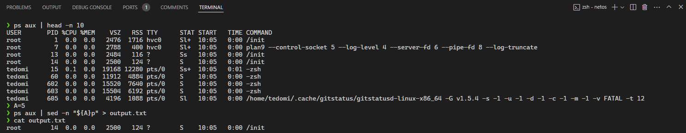

# Requirements

Ví dụ gán một giá trị biến A như sau A=10. Hãy viết số câu lệnh ít nhất có thể để in dòng thứ A trong tất cả các tiến trình đang chạy trong hệ thống ra 1 file output.txt

# Solutions 


## Commands


### Command 1


```sh
A=10
ps aux | sed -n "${A}p" > output.txt
```

## Results


### Result of Command 1 



