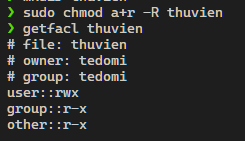
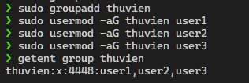
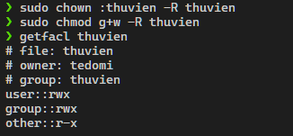

# Requirements

Cho thư mục thuvien, hãy thiết lập sao cho: 
- Bất kể người dùng nào, nhóm nào cũng có thể đọc được các file trong thư mục thư viện và các thư mục con
- Tạo và thiết lập để 3 người dùng user1, user2, user3 có quyền viết trên thư mục thuvien. Hãy chỉ ra cách thức sao cho quyền này có thể gán cho thêm nhiều người dùng mới cùng lúc một cách nhanh nhất.


# Solutions 


## Commands


### Command 1

Cấp quyền đọc cho tất cả người dùng

```sh
sudo chmod a+r -R thuvien
```

### Command 2
Tạo group `thuvien`

```sh
sudo groupadd thuvien
```

Thêm user1, user2, user3 vào group thuvien

```sh
sudo usermod -aG thuvien user1
sudo usermod -aG thuvien user2
sudo usermod -aG thuvien user3
```

### Command 3
Chuyển sở hữu thư mục thuvien cho group thuvien

```sh
sudo chown :thuvien -R thuvien
```
Cấp quyền write cho group của thư mục thuvien

```sh
sudo chmod g+w -R thuvien
```


## Results


### Result of Command 1 



### Result of Command 2



### Result of Command 3



