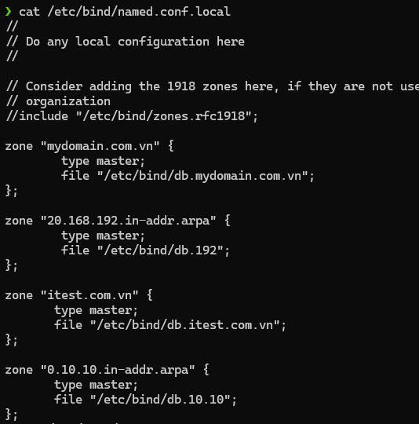
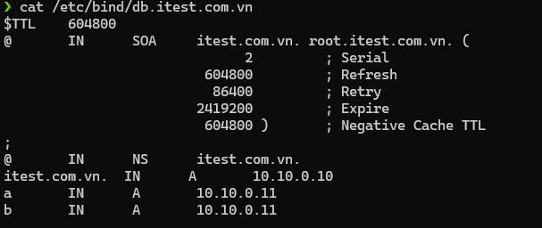
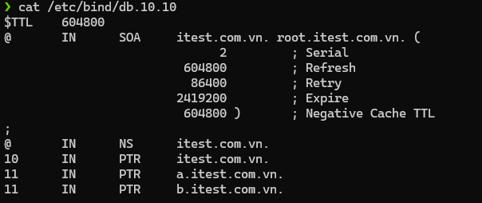
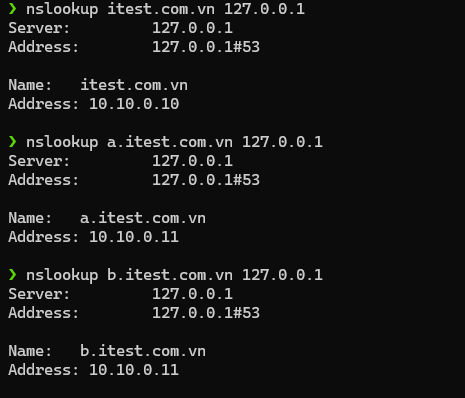
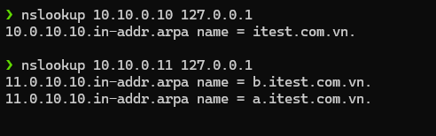

# Requirements
Hãy cấu hình phân giải xuôi/ngược cho tên miền:  
- itest.com.vn với địa chỉ ip 10.10.0.10 
- A.itest.com.vn và B.itest.com.vn cùng chỉ đến một máy có địa chỉ ip 10.10.0.11

# Solutions 

## Prerequisites

Cài đặt `bind`(*Berkeley Internet Name Distributed*)

```sh
sudo apt install bind9 dnsutils
```

## Commands

### Command 1

```sh
sudo nano /etc/bind/named.conf.local
```

### File content

```conf
zone "itest.com.vn" {
       type master;
       file "/etc/bind/db.itest.com.vn";
};
zone "0.10.10.in-addr.arpa" {
       type master;
       file "/etc/bind/db.10.10";
};
```
### Command 2   

```sh
sudo nano /etc/bind/db.itest.com.vn
```

### File content

```conf
$TTL    604800
@       IN      SOA     itest.com.vn. root.itest.com.vn. (
                              2         ; Serial
                         604800         ; Refresh
                          86400         ; Retry
                        2419200         ; Expire
                         604800 )       ; Negative Cache TTL
;
@       IN      NS      itest.com.vn.
itest.com.vn.  IN      A       10.10.0.10
a       IN      A       10.10.0.11
b       IN      A       10.10.0.11
```

### Command 3

```sh
sudo nano /etc/bind/db.10.10
```

### File content

```conf
$TTL    604800
@       IN      SOA     itest.com.vn. root.itest.com.vn. (
                              2         ; Serial
                         604800         ; Refresh
                          86400         ; Retry
                        2419200         ; Expire
                         604800 )       ; Negative Cache TTL
;
@       IN      NS      itest.com.vn.
10      IN      PTR     itest.com.vn.
11      IN      PTR     a.itest.com.vn.
11      IN      PTR     b.itest.com.vn.
```

### Command 4
Khởi động lại bind9

```sh
sudo systemctl restart bind9.service
```

## Results


### Result of Command 1 



### Result of Command 2



### Result of Command 3



### `nslookup` result



